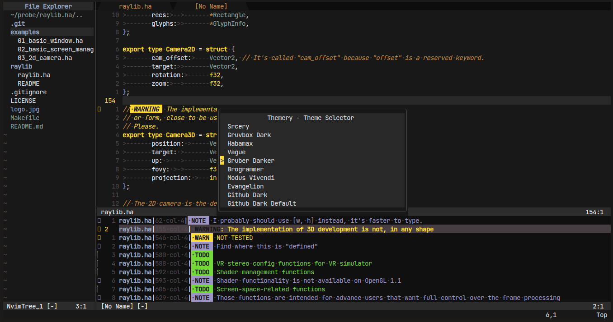

# My Neovim configuration.

Well, I don't really know how to start talking about this, but, this is my
config.

I've configured it to be a personal IDE, and one that I could easily modify, as
such, even if you are a noob, it's possible to use and change this config at
will without much of a headache.

It has a bunch of things pre-configured, like code-completion, a bunch of
themes (and a theme-switcher) pre-instaled, tree-sitter, lazygit/git
integration, telescope, etc.

Some of the things that you will probably need pre-instaled on your computer
are:

- fzf
- tree-sitter
- nerd-fonts
- clang/gcc (these are a must, since the tree-sitter's so's are compiled during
  the first execution)

The package manager used here is [Lazy.nvim](https://github.com/folke/lazy.nvim).

